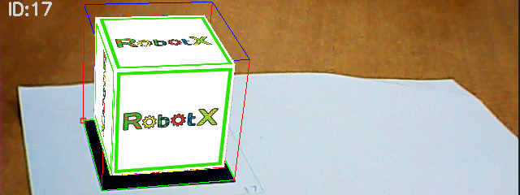
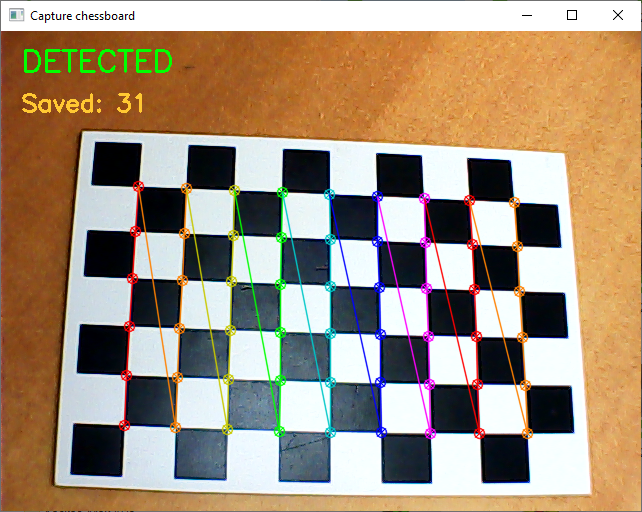
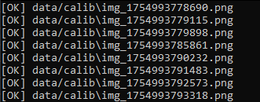
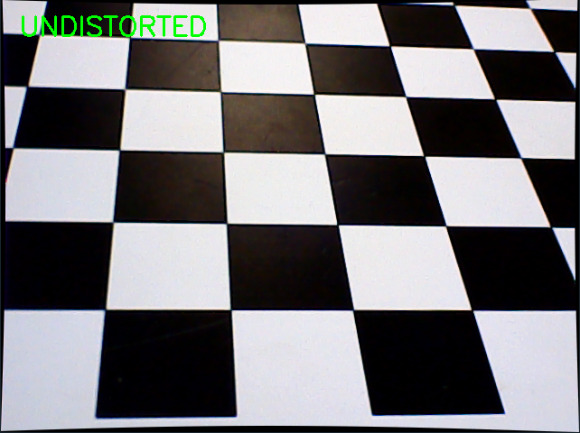
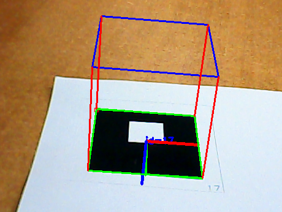
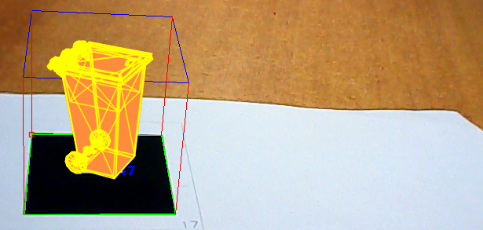
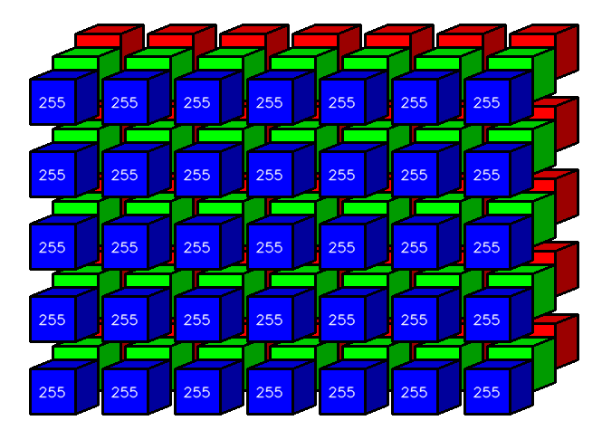

# AR на OpenCV: от калибровки до дополненной реальности с 3D-моделями



Этот репозиторий — практический мини-курс: шаг за шагом строим дополненную реальность (AR) на обычной USB-камере.
В процессе вы научитесь:

* **калибровать камеру**;
* **искать ArUco-маркер** и получать его **положение**;
* рисовать **оси, и куб**;
* вставлять внутрь куба **3D-модель из OBJ/MTL** с **текстурами**;


## Структура проекта

```
.
├─ 01_capture_chessboard_images.py     # Сохрание кадров с шахматной доски для калибровки
├─ 02_calibrate_camera.py              # Калибровка, сохранение параметров в .npz
├─ 03_undistort_preview.py             # Превью коррекции искажений
├─ 04_detect_aruco_and_cube.py         # ArUco + куб 
├─ 05_ar_aruco_obj.py                  # AR: OBJ/MTL с UV/текстурами внутри куба
├─ calibration_cam0.npz                # Пример параметров камеры после калибровки
├─ sample_textured_cube.(obj|mtl|png)  # Пример текстурированной модели - куб
```

## Установка

```bash
pip install opencv-contrib-python
```

> Нужен именно пакет **opencv-contrib-python** (в нём есть модуль `cv2.aruco`).
> Камера: внешняя USB, 640×480 достаточно.

---


## 1) Калибровка камеры

1. Распечатайте шахматную доску из файла chessBoard.pdf **7×10 клеток** (значит **6×9 внутренних углов**) и **измерь размер клетки** (мм).
2. Сними 20–40 кадров с разных ракурсов и масштабов:

```bash
python 01_capture_chessboard_images.py ^
  --out data/calib --cam 0 --width 640 --height 480 --cols 6 --rows 9
```

Нажимайте **пробел**, когда в окне зелёная надпись «DETECTED».



3. Проведите калибровку параметры камеры:

```bash
python 02_calibrate_camera.py ^
  --images_glob "data/calib/*.png" ^
  --cols 6 --rows 9 --square_size_mm 28 ^
  --save calibration_cam0.npz
```

Скрипт сохранит матрицу `K`, коэффициенты `dist`, калибровочное разрешение и RMS-ошибку.



---

## 2) Undistort-превью

Проверяем, что коррекция и ROI работают корректно:

```bash
python 03_undistort_preview.py --params calibration_cam0.npz --cam 0 --width 640 --height 480
```

* **U** — вкл/выкл undistort.
* При `alpha=1` по краям возможны «чёрные дуги». Это ок — в рабочих скриптах используется `alpha=0`, и мы рисуем только внутри ROI.



---

## 3) Куб над маркером

```bash
python 04_detect_aruco_and_cube.py ^
  --params calibration_cam0.npz ^
  --marker_size_mm 38 ^
  --cam 0 --width 640 --height 480 ^
  --dict 4X4_50
```



---

## 4) 3D-модель внутри куба (OBJ/MTL + текстуры)

```bash
python 05_ar_aruco_obj.py ^
  --params calibration_cam0.npz ^
  --marker_size_mm 38 --dict 4X4_50 ^
  --obj sample_textured_cube.obj --fit_to_cube 1 --textured 1
```

* Поддерживаются **OBJ + MTL и текстуры (PNG/JPG).
* Модель центрируется, масштабируется под куб.




---

## Горячие клавиши


* **ESC** — выход
* **C** — показать/скрыть куб
* **W** — каркас модели
* **F** — сплошная заливка
* **T** — включить/выключить текстуры
* **j/l** — yaw, **o/k** — pitch, **q/e** — roll
* **+ / −** — масштаб модели
* **Z / X** — смещение модели по «высоте» внутри куба (мм)
---

## Курс по компьютерному зрению

Хочешь системно прокачаться в компьютерном зрении? Я сделал практический курс на Stepik:

* описание курса: [https://stepik.org/course/109816/info](https://stepik.org/course/109816/info)
* оплата со скидкой: [https://stepik.org/a/109816/pay?promo=ce46797cb864a866](https://stepik.org/a/109816/pay?promo=ce46797cb864a866)
* **Промокод `LETO` — скидка 30% в августе 2025 г.**

В курсе разбираются все аспекты работы с изображениями: с "нуля" до работы с нейросетями MediaPipe и YOLO.


---

Исходный код использует OpenCV (opencv-contrib) и NumPy.
